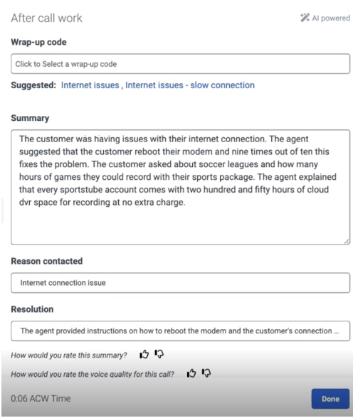
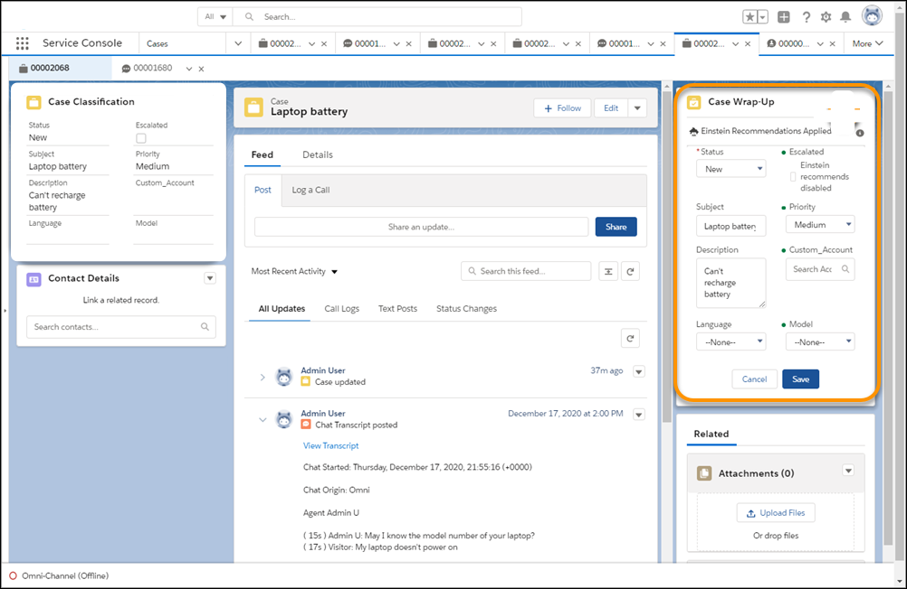
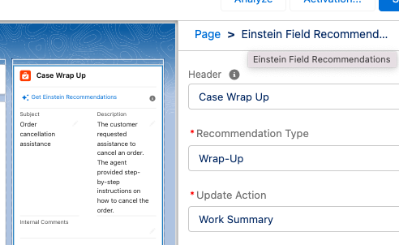
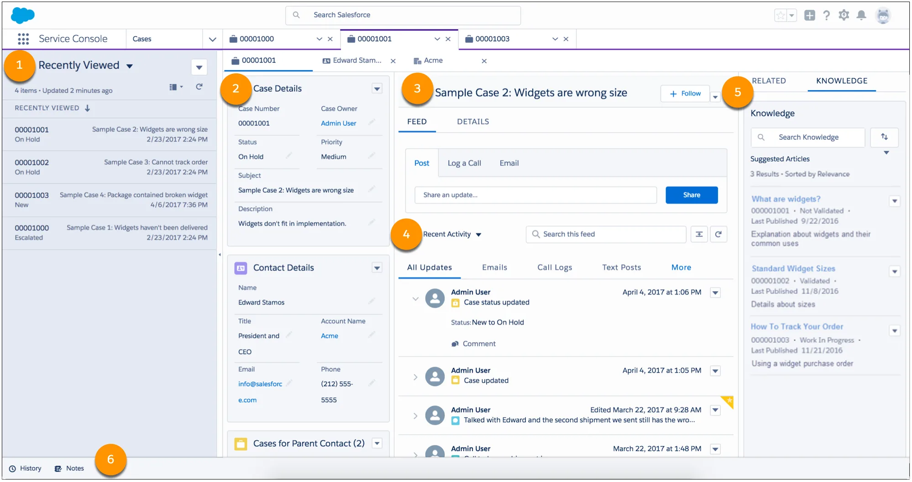
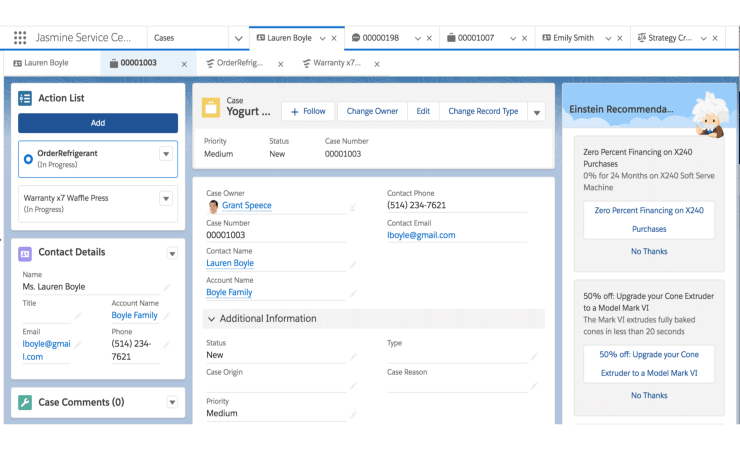
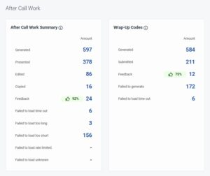
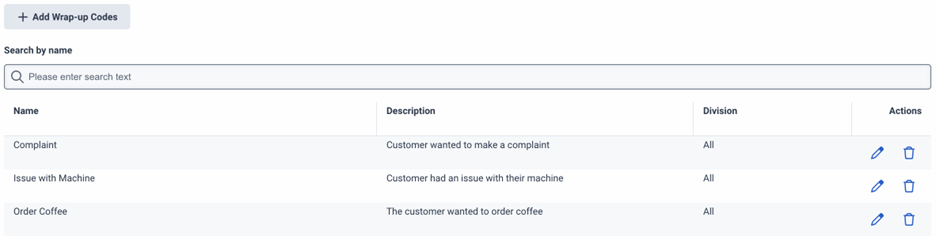
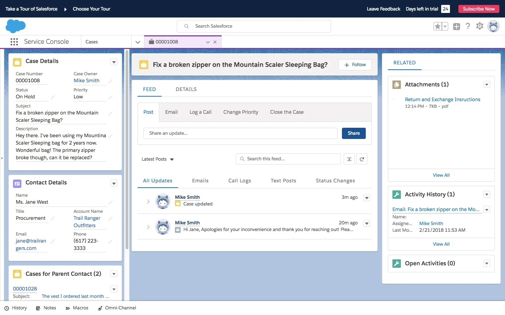
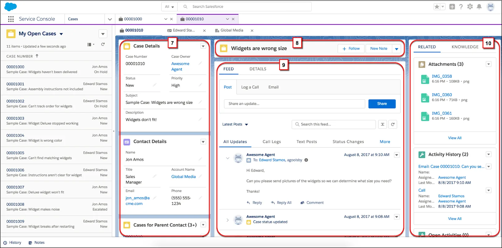
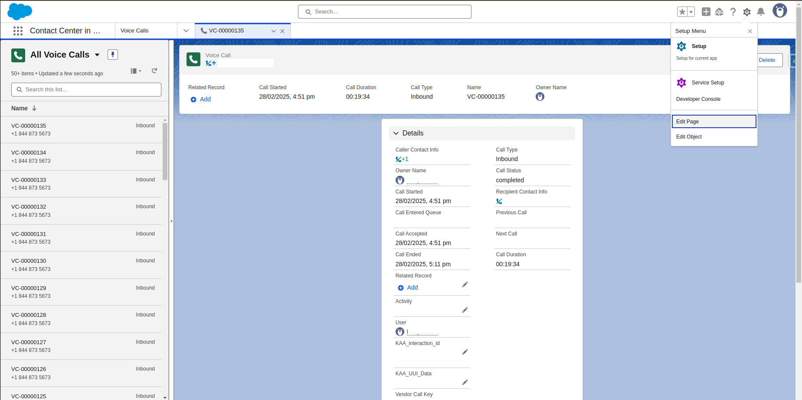

___

## What Your Agents Will Actually See: The Wrap-Up Flow in Salesforce + Genesys

Based on the documentation and your existing research, the wrap-up experience in your Salesforce + Genesys stack involves **two layers working together** — and the format you described in your research (write notes, pick disposition, update case fields, create follow-ups, complete checklist) is exactly what both platforms support.

### The Actual Screen Layout

Genesys recommends using the **Header with Three Region template** for the Voice Call record page in Salesforce. This is the page agents land on when a call comes in and stay on through wrap-up.

**What agents see during ACW (after the call ends):**

**Region 1 (Left column):**
- Case details / contact details (standard Salesforce)
- Phone Record Detail component showing call metadata (duration, queue time, etc.)

**Region 2 (Center):**
- The **Highlights Panel** at top with key case info
- Real-time transcript (during call) → becomes the completed transcript record
- For voice calls, as soon as a conversation ends, Einstein automatically fills out the summary, issue, and resolution fields. This usually appears in a "Wrap Up" window in the Service Console

**Region 3 (Right column) — this is where the AI wrap-up magic happens:**
- The Einstein Field Recommendations component displays on the page with a default header as "Wrap-Up" — this is Salesforce's native wrap-up panel
- The **Genesys ACW component** embeds as a Visualforce iframe directly on this same page

### The Genesys ACW Component Specifically

The ACW component displays wrap-up expiration times and codes, allows agents to enter call notes in the Description field under the Call Notes section on the Voice Call record page in Salesforce. It's recommended at 420 pixels height.

The ACW component displays Agent Copilot suggestions for wrap-up codes, AI-generated summaries, and visual timers for boxed and discretionary after call work time. The ACW UI also now includes a search function for wrap-up codes.

### The Step-by-Step Agent Experience at Wrap-Up

Here's what actually happens when the call ends, based on the Genesys use case documentation:

1. **AI Summary appears automatically** — When the agent ends the interaction, Agent Copilot generates an easily readable summary, and also offers suggestions for the Reason contacted and Resolution fields. Agent Copilot also predicts and suggests a wrap-up code.

2. **Agent reviews and edits notes** — Agents who use the technology don't have to write notes at all, they simply review what the copilot drafted, make edits if they choose, and save the notes to the system of record.

3. **Agent selects wrap-up code** — The copilot generates a short list of the most relevant codes, or even a single code, which the agent can either accept or adjust as needed. Instead of scrolling through hundreds of options, they get a prioritized shortlist.

4. **Agent checks compliance checklist** — Agent Copilot presents a checklist of up to seven items either at the start of the interaction or based on an intent trigger. The system can also automatically check the items as complete, based on text or voice detection.

5. **Agent rates the AI output** — You can rate the summary with the thumbs up or the thumbs down icon, which lets your admin know the positive upvote ratio for each summary.

6. **Case fields sync to Salesforce** — On the Salesforce side, Einstein Work Summaries predicts and fills key details such as summary, issue, and resolution into the case record fields. The generated summaries become more accurate and detailed as chat sessions progress.

### Two AI Systems, One Screen

The key nuance for your stack: you'll have **both** Genesys Agent Copilot (generating the interaction summary + wrap-up codes) **and** Salesforce Einstein (auto-filling case fields + case classification) working on the same Voice Call record page. The ACW component can be embedded in CX Cloud Voice Call record pages, displaying Agent Copilot suggestions, AI-generated summaries, and visual timers.

### What This Means for Your Prototype

Your prototype design with the 7 functional sections across 3 tabs (Summary & Notes, CRM Fields, Quality) maps accurately to what the production system delivers — you've essentially designed the "ideal state" that combines what both Genesys and Salesforce provide natively but in separate components today. The biggest value-add of your design is **collapsing the separate Genesys ACW panel and Salesforce Einstein Wrap-Up component into a single unified review-and-save flow**, rather than making agents interact with two different AI-generated outputs in two different spots on the page.

That's the gap your project fills — taking the 5+ discrete tasks (notes, disposition, case fields, follow-ups, checklist) that currently live in separate UI elements and presenting them as one cohesive panel with a single "Save & Complete."